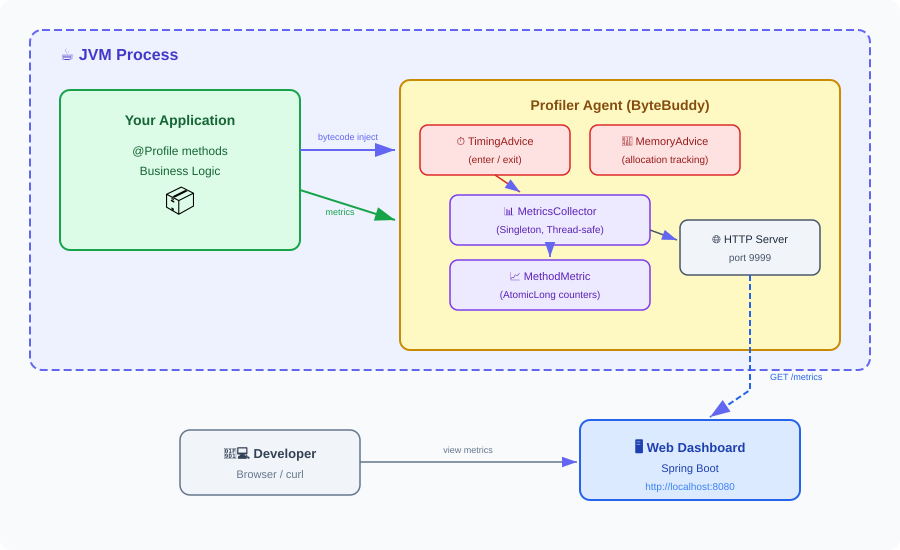
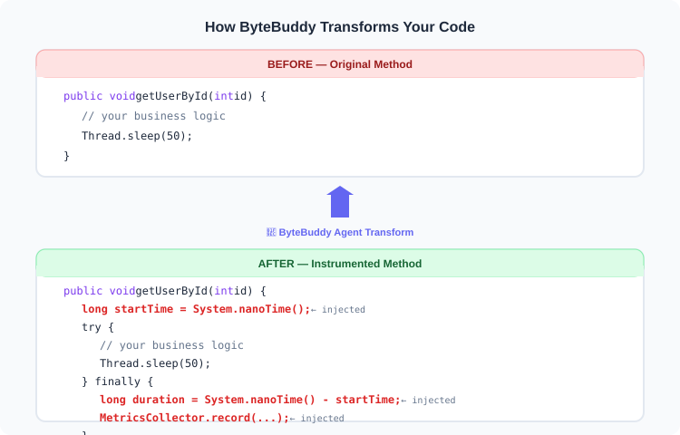
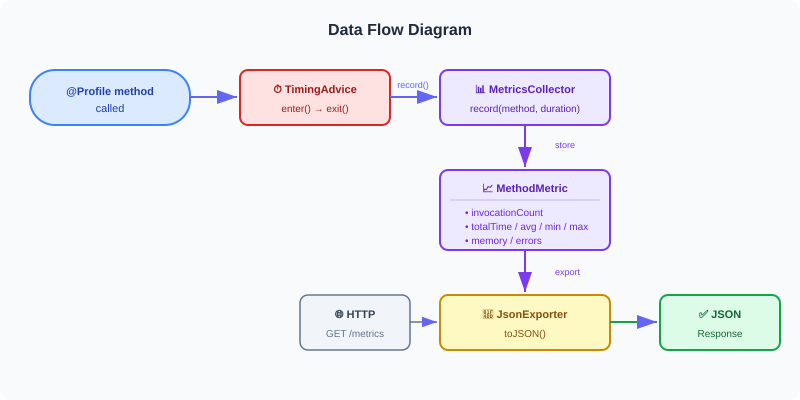

# 🔬 Method Profiler Java Agent

<p align="center">
  
  
  
  
  
</p>

<p align="center">
  <b>🚀 A production-grade Java method profiling agent with real-time web dashboard</b>
</p>

<p align="center">
  Zero code changes • Annotation-based • Low overhead • Real-time metrics
</p>

---

## 📖 Table of Contents

- [✨ Features](#-features)
- [🏗 Architecture](#-architecture)
- [📦 Project Structure](#-project-structure)
- [🚀 Quick Start](#-quick-start)
- [🎯 Usage Guide](#-usage-guide)
- [⚙️ Configuration](#️-configuration)
- [📊 Metrics API](#-metrics-api)
- [🛠 Tech Stack](#-tech-stack)
- [🎓 What I Learned](#-what-i-learned)

---

## ✨ Features

| Feature | Description |
|---------|-------------|
| 📊 **Real-time Profiling** | Track method invocations, execution time, and memory allocation |
| 🎯 **Annotation-based** | Use `@Profile` to selectively profile specific methods |
| 🌐 **Web Dashboard** | Beautiful Spring Boot UI for visualizing metrics |
| 🚀 **Zero Code Changes** | Attach as a Java Agent — no source modification needed |
| 📈 **JSON Metrics API** | RESTful API for integration with any monitoring tool |
| ⚡ **Low Overhead** | Uses ByteBuddy bytecode manipulation for minimal impact |
| 🔧 **Configurable** | Package filtering, custom ports, threshold-based logging |
| 🛡️ **Thread-safe** | Lock-free metrics collection using `AtomicLong` & `ConcurrentHashMap` |
| 💾 **Memory Tracking** | Optional per-method memory allocation monitoring |
| 🔥 **Error Tracking** | Automatically counts method exceptions |

---

## 🏗 Architecture

### High-Level Overview

<p align="center">
  
</p>

### How ByteBuddy Transforms Your Code

<p align="center">
  
</p>

### Data Flow Diagram

<p align="center">
  
</p>

> 💡 **Editable diagrams** are available in [`docs/architecture.drawio`](docs/architecture.drawio) — open with [draw.io](https://app.diagrams.net/)

---

## 📦 Project Structure

```
method-profiler/
├── 📁 profiler-agent/          ← Core agent (ByteBuddy + HTTP server)
│   └── src/main/java/com/profiler/agent/
│       ├── ProfilerAgent.java         # Main agent entry (premain/agentmain)
│       ├── advice/
│       │   ├── TimingAdvice.java      # Measures execution time
│       │   └── MemoryAdvice.java      # Tracks memory allocation
│       ├── annotation/
│       │   └── Profile.java           # @Profile annotation
│       ├── collector/
│       │   ├── MetricsCollector.java  # Singleton metrics store
│       │   └── MethodMetric.java      # Per-method statistics
│       └── exporter/
│           ├── JsonExporter.java      # Metrics → JSON converter
│           └── HttpServer.java        # Built-in HTTP endpoint
│
├── 📁 profiler-dashboard/      ← Spring Boot web dashboard
│   └── src/
│
├── 📁 profiler-demo-app/       ← Demo application for testing
│   └── src/main/java/com/demo/
│       └── DemoApp.java               # Sample app with @Profile methods
│
├── 📁 scripts/
│   └── run-demo.sh                    # Quick-start script
│
└── pom.xml                            # Parent Maven POM
```

---

## 🚀 Quick Start

### Prerequisites

- ☕ **Java 21+**
- 📦 **Maven 3.9+**

### Step 1: Build the project

```bash
mvn clean package -DskipTests
```

### Step 2: Run the demo app with the agent

**Linux/macOS:**
```bash
java -javaagent:profiler-agent/target/profiler-agent-1.0.0.jar=package=com.demo,port=9999 \
     -cp "profiler-demo-app/target/profiler-demo-app-1.0.0.jar:profiler-agent/target/profiler-agent-1.0.0.jar" \
     com.demo.DemoApp
```

**Windows (PowerShell):**
```powershell
java -javaagent:profiler-agent/target/profiler-agent-1.0.0.jar="package=com.demo,port=9999" `
     -cp "profiler-demo-app/target/profiler-demo-app-1.0.0.jar;profiler-agent/target/profiler-agent-1.0.0.jar" `
     com.demo.DemoApp
```

### Step 3: View metrics

```bash
curl http://localhost:9999/metrics
```

Or open in browser: [http://localhost:9999/metrics](http://localhost:9999/metrics)

### Step 4: Launch dashboard (optional)

```bash
mvn spring-boot:run -pl profiler-dashboard
# Open http://localhost:8080
```

---

## 🎯 Usage Guide

### Basic: Annotate methods with `@Profile`

```java
import com.profiler.agent.annotation.Profile;

public class UserService {

    @Profile
    public User getUser(Long id) {
        // This method will be profiled
        return userRepository.findById(id);
    }

    @Profile(name = "critical-payment")
    public void processPayment(Order order) {
        // Custom metric name for easy identification
    }

    @Profile(trackMemory = true)
    public List<Report> generateReports() {
        // Also tracks memory allocation
    }

    @Profile(thresholdMs = 100)
    public void fastOperation() {
        // Only logged if execution exceeds 100ms
    }
}
```

### Advanced: Profile entire class

```java
@Profile  // All public methods in this class will be profiled
public class OrderService {
    public void createOrder() { ... }
    public void cancelOrder() { ... }
}
```

### Package-level profiling (no annotations needed)

```bash
# Profile ALL public methods in com.myapp package
java -javaagent:profiler-agent-1.0.0.jar=package=com.myapp -jar myapp.jar
```

---

## ⚙️ Configuration

Agent arguments are passed as key-value pairs:

```
-javaagent:profiler-agent-1.0.0.jar=key1=value1,key2=value2
```

| Parameter | Default | Description |
|-----------|---------|-------------|
| `package` | `com.demo` | Package prefix to auto-profile |
| `port` | `9999` | HTTP metrics server port |

**Example:**
```bash
java -javaagent:profiler-agent-1.0.0.jar=package=com.mycompany.app,port=8888 -jar app.jar
```

---

## 📊 Metrics API

### `GET /metrics` — Get all metrics

**Response:**
```json
[
  {
    "method": "com.demo.DemoApp.getUserById(int)",
    "invocations": 150,
    "totalTimeMs": 12450.32,
    "avgTimeMs": 83.00,
    "minTimeMs": 50.12,
    "maxTimeMs": 148.67,
    "totalMemoryKB": 0.0,
    "errors": 0
  },
  {
    "method": "com.demo.DemoApp.mayThrowError()",
    "invocations": 150,
    "totalTimeMs": 1.85,
    "avgTimeMs": 0.012,
    "minTimeMs": 0.001,
    "maxTimeMs": 0.089,
    "totalMemoryKB": 0.0,
    "errors": 45
  }
]
```

### `GET /reset` — Reset all metrics

**Response:**
```json
{"status": "reset"}
```

---

## 🛠 Tech Stack

| Technology | Purpose |
|-----------|---------|
| 🧬 [ByteBuddy](https://bytebuddy.net/) | Runtime bytecode manipulation |
| ☕ Java Instrumentation API | Agent infrastructure (`premain`/`agentmain`) |
| 🌱 Spring Boot 3 | Dashboard backend |
| 🎨 Vanilla JS | Dashboard frontend |
| 📦 Maven Shade Plugin | Fat JAR with relocated dependencies |
| 🔒 `AtomicLong` / `ConcurrentHashMap` | Lock-free thread safety |
| 🌐 `com.sun.net.httpserver` | Lightweight embedded HTTP server |
| 📝 Jackson | JSON serialization |

---

## 🎓 What I Learned

| Topic | Details |
|-------|---------|
| 🕵️ Java Agent | `premain` vs `agentmain`, `Instrumentation` API |
| 🧬 Bytecode Manipulation | ByteBuddy's `Advice` pattern for method instrumentation |
| 🎭 Visitor Pattern | ASM visitor wrappers for class transformation |
| ⚛️ Thread Safety | Lock-free programming with CAS loops (`AtomicLong`) |
| 🌐 HTTP Server | Building a lightweight server with `com.sun.net.httpserver` |
| 📦 Maven Shade | Dependency relocation to avoid classpath conflicts |
| 🔄 JVM Internals | Class loading, retransformation, agent attachment |

---

## 📄 License

This project is for educational and demonstration purposes.

---

<p align="center">
  Made with ☕ and curiosity
</p>
